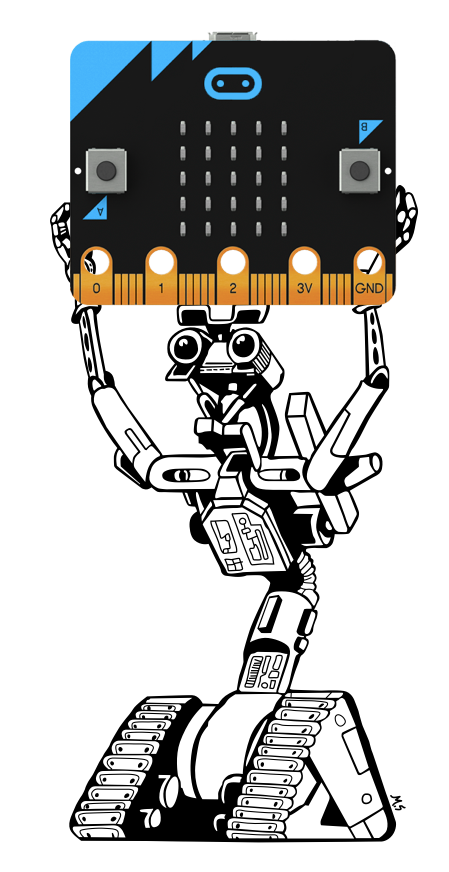

# bbc-microbit-io



[Johnny-Five](https://github.com/rwaldron/johnny-five) [IO Plugin](https://github.com/rwaldron/io-plugins) for the [BBC micro:bit](https://www.microbit.co.uk/)

## Prerequisites

 * [BBC micro:bit](https://www.microbit.co.uk/)
 * Bluetooth Low Energy capable Mac or Linux computer
   * See [node-bbc-microbit prerequisites](https://github.com/sandeepmistry/node-bbc-microbit#prerequisites)

## Getting Started

```sh
npm install bbc-microbit-io johnny-five
```

## Boilerplate Program

```javascript
var five = require('johnny-five');
var microbitio = require('bbc-microbit-io');

var board = new five.Board({
  io: new microbitio({
    // id: '<id of micro:bit>', // optional
    // address: '<address of microbit>' // optional
  })
});

board.on('ready', function() {
  // do Johnny-Five stuff
});
```

## Examples

See [examples](examples) folder as well as [Johnny-Five examples](http://johnny-five.io/examples/).

## API

See  [Johnny-Five API docs](http://johnny-five.io/api/).

## Pin Guide

| Johnny-Five Compatible Name | Number | Supported Modes |
|-----------------------------|--------|-----------------|
| A0 | 0 | Input, Output, Analog, PWM |
| A1 | 1 | Input, Output, Analog, PWM |
| A2 | 2 | Input, Output, Analog, PWM |
| A3 | 3 | Input, Output, Analog, PWM |
| A4 | 4 | Input, Output, Analog, PWM |
| | 5 | Input, Output |
| | 6 | Input, Output |
| | 7 | Input, Output |
| | 8 | Input, Output |
| | 9 | Input, Output |
| A5 | 10 | Input, Output, Analog, PWM |
| | 11 | Input, Output |
| | 12 | Input, Output |
| | 13 | Input, Output |
| | 14 | Input, Output |
| | 15 | Input, Output |
| | 16 | Input, Output |
| | 17 | - |
| | 18 | - |
| | 19 | Input, Output |
| | 20 | Input, Output |


## Additional Features

| Type | Usage | Johnny-Five type |
| ---- | ----- | -------- |
| Accelerometer | `new microbitio.Accelerometer();` | [five.Accelerometer](http://johnny-five.io/api/accelerometer/) |
| Button | `new microbitio.Button('A');` or `new microbitio.Button('B');` | [five.Button](http://johnny-five.io/api/button/) |
| Compass | `new microbitio.Compass();` | [five.Compass](http://johnny-five.io/api/compass/) |
| LED Matrix | `new microbitio.LedMatrix();` | [five.Led.Matrix](http://johnny-five.io/api/led.matrix/) |
| Thermometer | `new microbitio.Thermometer();` | [five.Thermometer](http://johnny-five.io/api/thermometer/) |
